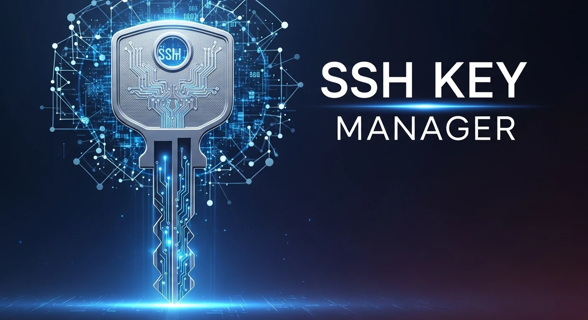

# Key Manager

Readme: [BR](README.md)

 



**Key Manager** is an advanced utility tool developed in Shell Script to simplify, automate, and audit SSH key management in Linux environments.

Unlike common deployment scripts, this tool was designed with a focus on **Cybersecurity** and **Traceability**, solving the "chicken and egg problem" (needing a password to configure passwordless access) in a secure, silent, and traceable way.

## Advanced Features

- **Smart Connection:** Tests key-based connectivity before attempting any changes, preventing duplication in `authorized_keys`.
- **Automatic Deploy (`sshpass`):** Injects the public key into the remote server without interactive prompts, ideal for automation and pipelines.
- **Full Traceability:** Adds `Hostname`, `Source IP`, and `Timestamp` as a comment to the public key installed on the destination.
- **Remote Audit Log:** Centrally records all deployment actions and access attempts in the `/var/log/key.audit` file on the remote server.
- **Force Update Mode:** Allows purging `authorized_keys` and `known_hosts` to force a clean renewal of compromised or outdated access.
- **Anti-Junk Protection:** Uses `trap` to ensure that passwords in memory and temporary files `/tmp/deploy_*.pub` are destroyed even if the script is abruptly aborted.

---

## Prerequisites

For the script to work correctly, your local machine (client) must have the following packages installed:

```bash
# On Debian/Ubuntu-based systems:
sudo apt update && sudo apt install sshpass openssh-client curl gawk -y
```

> Note for the Destination Server:
> For the first deployment, the remote server must temporarily allow password authentication (PasswordAuthentication yes in /etc/ssh/sshd_config). After deployment, it is recommended to disable this option.

## Installation

1. **Download the file on the server:**

```bash
curl -O https://raw.githubusercontent.com/sr00t3d/key_manager/refs/heads/main/key_manager.sh
```

2. **Grant execution permission:**

```bash
chmod +x key_manager.sh
```

3. **Run the script:**

```bash
./key_manager.sh
```

## How to Use

Basic Syntax:

```bash
key-manager <SERVER_IP> [options]
```
```bash
Flag        Argument        Description
-p          <password>      Remote user password for automatic deployment.
-P          <port>          Custom SSH port (Default: 22).
-u          <user>          Remote server user (Default: root).
-n          <name>          Local key filename (Default: id_rsa).
-c          <text>          Replaces automatic traceability with a custom comment.
-k          None            Force Update: Cleans old records and forces key reinstallation.
-h          None            Displays the help menu.
```

## Practical Usage Examples

1. First Access (Automatic Deploy) Generates the key (if it does not exist), adds the trusted host, installs the key, and logs on the server:

```bash
key-manager 192.168.1.100 -p "my_secret_password"
```

2. Daily Use (Quick Connection) Detects that the key already exists and immediately opens the terminal:

```bash
key-manager 192.168.1.100
```

3. Update Compromised Key / Machine Replacement The -k parameter scans the old authorized_keys and installs the new key cleanly:

```bash
key-manager 192.168.1.100 -p "my_secret_password" -k
```

4. Deploy for Specific User with Custom Name

```bash
key-manager 10.0.0.5 -u ubuntu -p "password" -c "Temporary_Dev_Access"
```

## Audit System (Compliance)

Whenever an action is executed, the script writes a log on the destination server at /var/log/key.audit. This is essential to maintain compliance and to know who accessed from where.

Example output on the remote server:

```bash
[28/02/2026 14:30:12] ACTION: KEY_DEPLOYED | FROM: 177.10.x.x | HOST: sr00t3d-pc
[28/02/2026 15:45:00] ACTION: LOGIN_SUCCESS | FROM: 177.10.x.x | HOST: sr00t3d-pc
```

*Additionally, running cat ~/.ssh/authorized_keys will show the exact origin watermark at the end of the public key string.*

## Security Notice

This script handles credentials. Never hardcode passwords in automated scripts. For greater security, avoid leaving passwords in terminal history (on standard Linux distributions, starting a command with a blank space  ./key-manager... prevents it from being saved in ~/.bash_history).

## Legal Notice

> [!WARNING]
> This software is provided "as is." Always make sure you have explicit permission before executing it. The author is not responsible for any misuse, legal consequences, or data impact caused by this tool.

## Detailed Tutorial

For a complete, step-by-step guide, check out my full article:

👉 [**Easily manage your SSH keys**](https://perciocastelo.com.br/blog/easy-manager-your-ssh-keys.html)

## License

This project is licensed under the **GNU General Public License v3.0**. See the [LICENSE](LICENSE) file for more details.